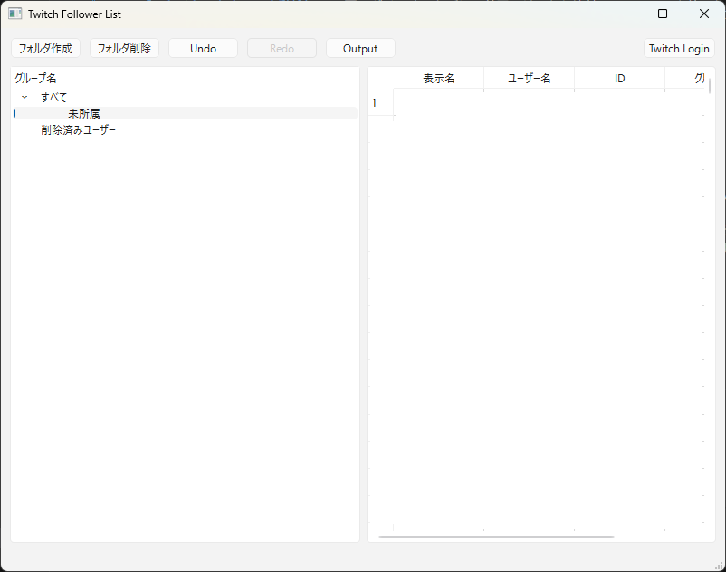
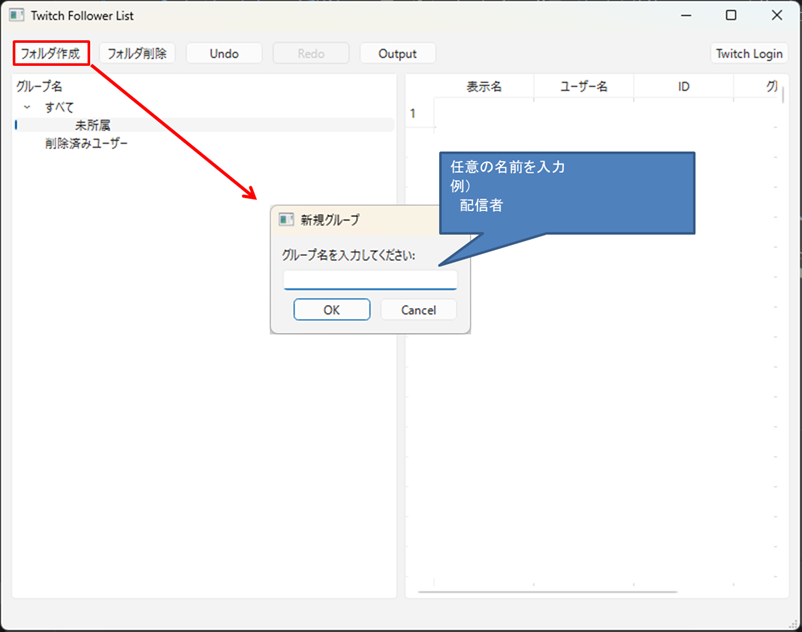
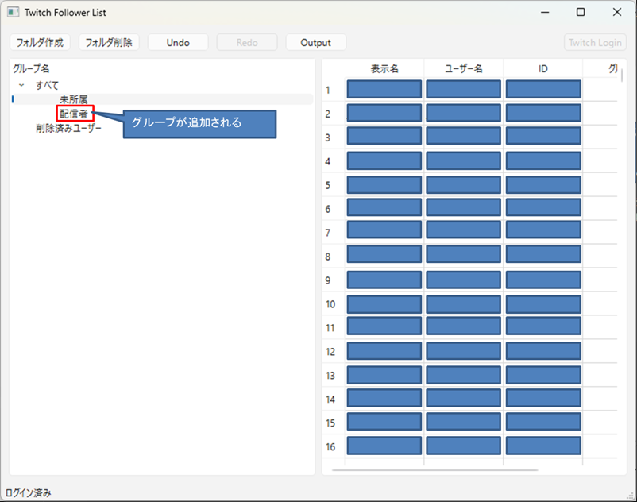
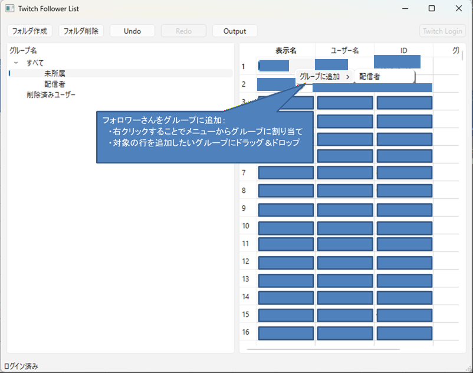

# Twitch Follower Manager 🛠️💜

**Twitch Follower Manager** は、あなたの配信を支えてくれるフォロワーさんを賢く管理するためのデスクトップツールです。
「フォロワーさんが増えてきて管理が大変…」「最近見かけないあの人、フォロー外れちゃったかな？」といった悩みを解決します。

---

## ✨ 主な機能

- **フォルダ分け管理**: ドラッグ＆ドロップでフォロワーさんを自由にグループ分け（VIP、常連さん、等）できます。
- **「いなくなった人」の自動検知**: 再ログインするたびに、前回のリストと比較してフォローを外した人を「削除済みユーザー」として自動的にまとめます。
- **安心のセキュリティ**: データはあなたの **Twitch ID** を鍵にして暗号化されます。万が一ファイルが流出しても、他の人には中身を読み取れない「魔法の鍵」がかかっています。
- **Excel 出力**: 整理したリストをボタン一つで Excel で開ける形式（CSV）で保存できます。

---

## 🚀 使い方（一般ストリーマーの方）

プログラムの知識がなくても大丈夫です！以下のステップで始められます。

1. **ダウンロード**: [FollowerList_v1.0.zip](bin/FollowerList_v1.0.zip) をクリックしてダウンロードします。
2. **準備**: ダウンロードした ZIP ファイルを右クリックして「すべて展開」を選び、フォルダを取り出します。
3. **実行**: フォルダの中にある `FollowerList.exe` をダブルクリックして起動します。
4. **ログイン**: 画面上の `Twitch Login` ボタンを押すとブラウザが開きます。Twitch でアクセスを許可してください。
5. **管理開始**: しばらく待つとフォロワーリストが表示されます。好きなフォルダを作って整理しましょう！

---

## 📖 操作方法

### 1. メイン画面とログイン

起動直後はリストが空の状態です。まずは各ボタンの役割を確認しましょう。

| 部位 / ボタン | 役割 |
| :--- | :--- |
| **フォルダ作成** | 新しいグループを作成します。 |
| **フォルダ削除** | 選択中のグループを削除します。中にいた人は「未所属」に戻ります。 |
| **Undo / Redo** | 操作を一つ戻したり、やり直したりします。 |
| **Output** | 全グループのリストを CSV ファイルとして一括保存します。 |
| **Twitch Login** | Twitch 連携を行い、最新のフォロワー情報を取得します。 |
| **左側エリア** | 作成したフォルダの一覧が表示されます。 |
| **右側エリア** | 選択したフォルダに入っているフォロワーさんが表示されます。 |

ログインボタンから認証を行うと、あなたのフォロワーリストが自動的に取得されます。

### 2. グループ（フォルダ）の作成

`フォルダ作成` ボタンを押すと、新しいグループを作ることができます。「配信者」「常連さん」など、好きな名前を付けて管理しましょう。


### 3. フォロワーさんの振り分け

フォロワーさんをグループに入れるには 2 つの方法があります。
- **ドラッグ＆ドロップ**: リストの行を掴んで、左側のグループ名に直接放り込みます。
- **右クリック**: 名前の上で右クリックするとメニューが出て、所属先を素早く変更できます。

### 4. その他の便利な機能
- **Undo / Redo**: 「間違えてフォルダを消しちゃった！」「別のグループに入れちゃった」という時も、`Undo` ボタンで一つ前の状態に戻せます。
- **Output (CSV出力)**: 整理したリストをまとめて保存します。出力日時の付いたフォルダが作られ、グループごとの CSV ファイルが生成されます。
- **削除済みユーザー**: いつの間にかいなくなってしまったフォロワーさんは、自動的にこのフォルダにまとめられます。

---

## 🛠️ 自分でビルドしたい方（開発者向け）

このプロジェクトを自分でコンパイルして動かしたい方向けの情報です。

### 動作環境
- **OS**: Windows 10/11
- **フレームワーク**: Qt 6.10.1 以上
- **コンパイラ**: MinGW 13.1.0 以上 (64-bit)
- **ビルドシステム**: CMake 3.16 以上

### 依存ライブラリ
- [TransCipher](Lib/TransCipher): 独自開発の暗号化ライブラリ（プロジェクトに同梱されています）。

### ビルド手順
1. このリポジトリをクローンします。
2. Qt Creator またはコマンドラインから CMake プロジェクトとして開きます。
3. 以下のコマンドでビルド可能です：
   ```bash
   mkdir build
   cd build
   cmake .. -G "Ninja" -DCMAKE_BUILD_TYPE=Release
   ninja
   ```

---

## 🔒 セキュリティとプライバシー

- このアプリは、あなたの Twitch パスワードを保存しません。認証は Twitch 公式の安全な仕組み（OAuth）で行われます。
- 保存されるデータ（`.dat` ファイル）は、あなたの Twitch 固有の ID を使って強力に暗号化されています。

---

## 📝 ライセンス
本プロジェクトは [MIT License](LICENSE) の下で公開されています。
