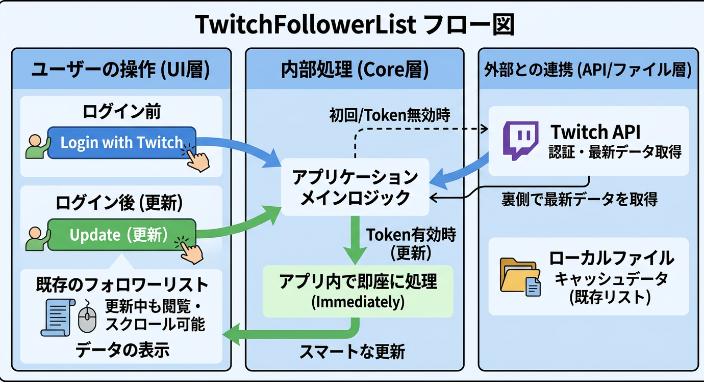

# 要件定義 (Requirements)

## 1. プロジェクト概要
本システムは、Twitch 配信者が自身のフォロワーを効率的に管理し、グループ分けや削除されたユーザーの追跡を安全に行うためのデスクトップアプリケーションである。
C++およびQtフレームワークを使用して開発する。

*図1: システム構成概要（ユーザー・アプリ・外部連携の関係）*

## 2. 機能要件
### 2.1. 認証機能
- ユーザーは本ツールからTwitchのOAuth認証を行い、アクセストークンを取得できる。
- **具体的な認証フロー**:
  1. アプリケーション（ツール）を起動する。
  2. 「Twitch Login」ボタンをクリックする。
  3. 標準ブラウザが自動的に開き、Twitchのログインおよびアクセス許可画面が表示されるため「許可」をクリックする。
  4. ブラウザから自動的にツール側へ処理が戻る。
  5. 認証完了（取得したトークンはツール裏側で自動保存される）。
- 取得したトークンが有効期間内であればログイン済みと判定するが、**「最新情報への更新」および「再ログイン」を可能にするため、ログインボタンは原則として常に活性状態（操作可能）を維持する。**

### 2.2. ファイルシステム連動機能
- プロジェクト内の `out` ディレクトリの内容を監視・読み込み、階層構造をツリービューで表示する。
    - **各項目（グループ、未所属、すべて）の横に、所属するフォロワーの件数を `(n)` の形式で表示する。**

### 2.3. フォロワー取得およびファイル保存機能
- 初回ログイン時（ログイン完了のタイミング）に、Twitch APIを利用して自動的にフォロワーの一覧を取得する。
- 取得したフォロワーの一覧をリストビューに表示するとともに、以下のルールで加工して `out` ディレクトリ内に保存する。
  - **`AllList.dat`** (※以前の.batから.datへ修正)
    1. フォロワー情報をCSV形式でリストアップする。（項目: No, 表示名, ユーザ名, ユーザID, **チャンネルURL**, **グループID**）
       ※複数グループに所属している場合は、グループIDの列に特定の区切り文字（例: `1|3|5`）を用いて格納する。
    2. 生成したデータ（CSV文字列等）を、共通暗号化ライブラリ **`TransCipher`** を使用して暗号化する。
    3. 暗号化にはアプリケーション内部で保持する秘密鍵を使用し、データの秘匿性を担保する。
    4. 暗号化されたバイナリデータを Base64 エンコードしてファイルに書き込む。

### 2.4 データ永続化とセキュリティ
- 全てのリストデータ (`.dat`) および操作履歴は、共通暗号化ライブラリ `TransCipher` を用いて暗号化・保存すること。
- **プライバシー保護**: 暗号化キーの生成には「プロジェクト固定キー」に加え、**「ログイン中の Twitch ユーザー ID (Numeric)」** を組み込むこと。これにより、同じアプリケーションを使用しても、他人のデータファイルを覗き見ることができない仕組みとする。
- データの保存先は `out/` ディレクトリ配下とし、設定ファイルは `Config/` ディレクトリに集約すること。

### 2.5. グループ（フォルダ）管理機能
- ユーザーはUI上の「フォルダ作成」「フォルダ削除」ボタンを使用して、フォロワーを分類するグループを作成・削除できる。
- 作成されたグループはツリービューに表示され、実際のファイルシステム上にも `out/グループ名/` としてフォルダが作成される。
- **グループ名の変更**: ユーザーは作成済みのグループ名を変更できる。変更時は関連するフォルダ名および設定ファイル内の記述も自動的に更新される。
- **フォロワーのアサインと所属仕様**:
  - フォロワーは複数のグループへの重複所属が可能。
  - どこにも所属しないフォロワーのために、デフォルトで「未所属」グループ（および `out/未所属/` フォルダ）が存在する。
  - UI上（リストビュー）のフォロワーを選択し、ツリービューのフォルダへ「ドラッグ＆ドロップ」することで所属させる。
  - ツリービューのフォルダをクリックすると、右側のリストビューがそのフォルダ内のフォロワーのみに「絞り込み表示」される。ツリービューの「ルート（大元）」をクリックすると全フォロワーが表示される。
  - フォルダ削除時は、そのフォルダに所属していたフォロワーから該当のグループIDのみが削除される。全グループから外れた場合は「未所属」に戻る。
- **`GroupsList.dat`**:
  - `out` ディレクトリ直下に作成され、存在するグループの一覧を管理する。
  - 項目: `グループID`, `グループ名` （エンコード仕様は `AllList.dat` と共通）
  - グループIDは連番で付与される。グループが削除された場合はそのIDを欠番とし、新規作成時に欠番が優先して再利用される。
- **各グループの `Lists.dat`**:
  - 各グループのフォルダ（「未所属」含む）内に `Lists.dat` を生成する（エンコード仕様は `AllList.dat` と共通）。
  - `AllList.dat` の中から、該当するグループIDを持つフォロワーのみを抽出して格納する。

### 2.6. アンドゥ・リドゥ（操作の取り消し・やり直し）機能
- グループへの振り分けやフォルダの作成・削除等の操作に対して、アンドゥ（Undo）およびリドゥ（Redo）をサポートする。
- UI上からは直近5回までのアンドゥ・リドゥ操作が可能。
- **履歴の永続化（ActionHistory.dat）**:
  - アプリケーション起動時からのすべての操作履歴を記録・保存する。
  - プロジェクトルートに `Config` フォルダを作成し、その中に `ActionHistory.dat` として保存する。
  - ファイルのエンコード仕様は他の出力ファイル（`AllList.dat`等）と同様、`TransCipher` による暗号化を施すものとする。
- **名前変更の追跡**: グループ名の変更操作も履歴に記録され、Undo/Redo が可能であること。

### 2.8. 誤操作防止とUX向上
- **データの保護**: リストビュー上の「表示名」「ユーザー名」「ユーザーID」などの基本情報は、ユーザーが誤って書き換えないよう「読み取り専用」に設定すること。
- **リンクの保護**: チャンネルURL列も読み取り専用とし、ダブルクリックによるブラウザ起動機能のみを提供する。
- **一貫性のある操作**: グループ名の変更や削除は、ツリービュー上の右クリックメニューから直感的に行えるようにすること。

### 2.7. 出力（Output）機能
- ユーザーは UI 上の「Output」ボタンを使用して、全グループのフォロワーリストを一括で外部ファイルへ書き出すことができる。
- **出力仕様**:
  1. **操作フロー**: ボタン押下時にフォルダ選択ダイアログを表示する。選択された保存先ディレクトリ内に、出力日時（`YYYY-MM-DD_HH-MM-SS`）を名称としたサブフォルダを自動作成する。
  2. **ファイル構成**: 作成されたサブフォルダ内に、各グループ名（「未所属」等を含む）をファイル名とした CSV ファイル（例: `配信者.csv`）を生成する。
  3. **書き出し形式**: 暗号化されていない「平文の CSV 形式」とする。
  4. **文字コード**: **UTF-8 (BOM付き)** とする。これにより、Excel 等で直接開いた際の文字化けを防止する。
  5. **出力項目**: 表示名、ユーザ名、ユーザID、**グループ（所属名）** の 4 項目とする。
- この機能により、本ツールで分類したリストを他の配信支援ツールや表計算ソフトで安全かつ容易に活用することを可能にする。

### 2.9 履歴管理および日付データの強化
- **フォロー/アンフォロー履歴の蓄積**:
  - 各フォロワーに対して、フォローされた日時およびフォロー解除（アンフォロー）を検知した日時の履歴をすべて蓄積する。
  - Twitch API から取得できる最新のフォロー日時に加え、ローカルでのチェック時に「消失（アンフォロー）」および「再出現（再フォロー）」を検知したタイミングを独自の履歴として保持する。
- **データ表示仕様**:
  - **メインリスト表示**: フォロワーリスト上には、対象ユーザーの「最古のフォロー日」と「最新のアンフォロー日（存在する場合）」を表示する。
  - **詳細履歴の可視化**: リストの該当行にマウスカーソルを合わせた際（ツールチップ）、すべてのフォロー・アンフォロー履歴を対応関係がわかるテーブル形式で表示する。
- **データ蓄積の永続化**:
  - API から取得できる情報は限定的（通常は最新の一つ）であっても、アプリケーション内部（保存ファイル内）には過去の情報を捨てずに蓄積し続ける。

### 2.10. ソート機能
- ユーザーはフォロワーリストの各列（表示名、ユーザー名、フォロー開始日、グループ名等）をクリックすることで、昇順・隔順の並び替えができる.
- 並び替えの状態（どの列を基準に、どちらの順序でソートしているか）は、アプリケーション終了後も自動的に保存され、次回起動時に復元される.

### 2.11. メモ機能
- 各フォロワーに対して、ユーザーが自由に入力・保存できるテキスト領域（メモ）を提供する.
- メモの内容はフォロワーリストの専用列に表示され、リスト上で直接編集（ダブルクリック等）が可能.
- 入力されたメモは暗号化データ（`AllList.dat` 等）の一部として永続化される.
- メモ内にカンマ（`,`）や改行などの特殊文字が含まれても、CSV 構造を破壊しないよう適切なエスケープ処理を施す.

## 3. 非機能要件
- **開発言語**: C++
- **GUIフレームワーク**: Qt
- **プラットフォーム**: Windows
- **自動テスト要件**:
  - UI操作（クリック、右クリック、キー入力）をシミュレートし、内部ロジックおよびファイル出力の正当性を自動検証できること.
  - 開発者が手動で操作する前に、主要なユースケース（ログイン、グループ管理、Undo/Redo、ソート、メモ保存）が正常動作することをコードで担保すること.

## 4. 例外処理（ネットワーク異常対応）
- **タイムアウト処理**: 通信（認証・API取得）開始から一定時間（例：30秒）応答がない場合、自動的に処理を中断し、UIのロックを解除すること.
- **エラー通知**: タイムアウトや通信エラーが発生した際、ユーザーに対して「ネットワーク接続を確認してください」といった旨の警告メッセージを表示すること.
